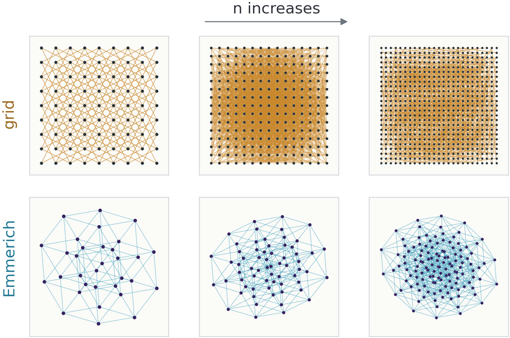
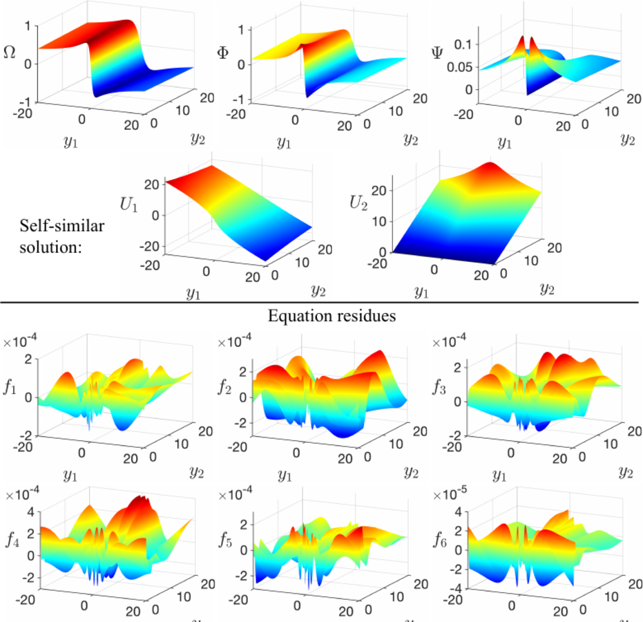
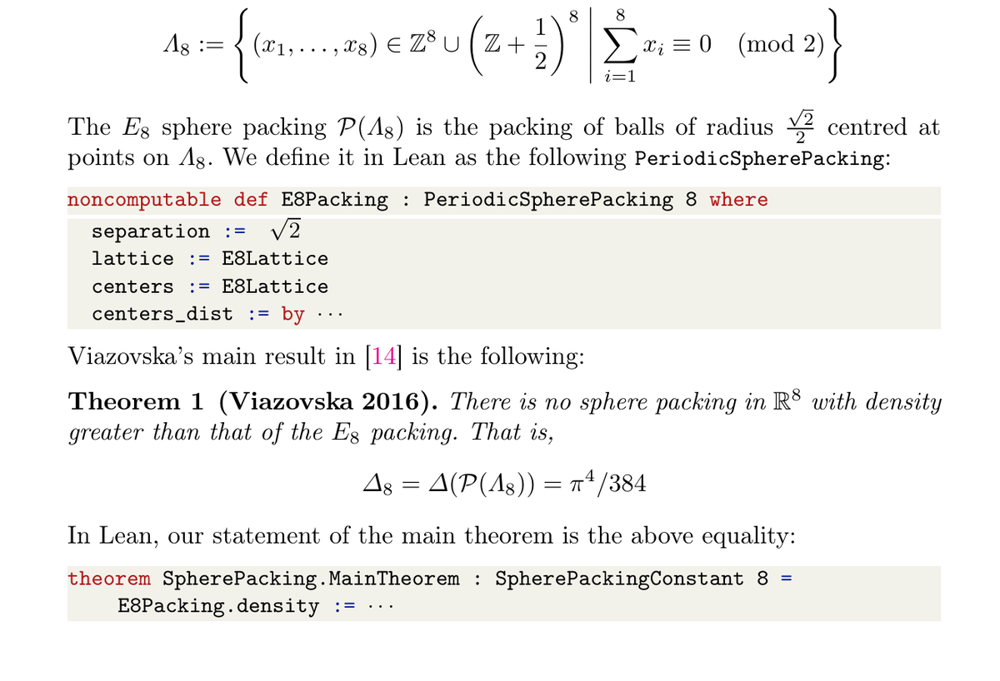
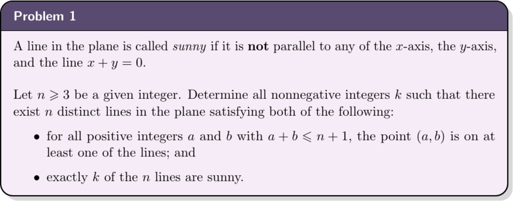
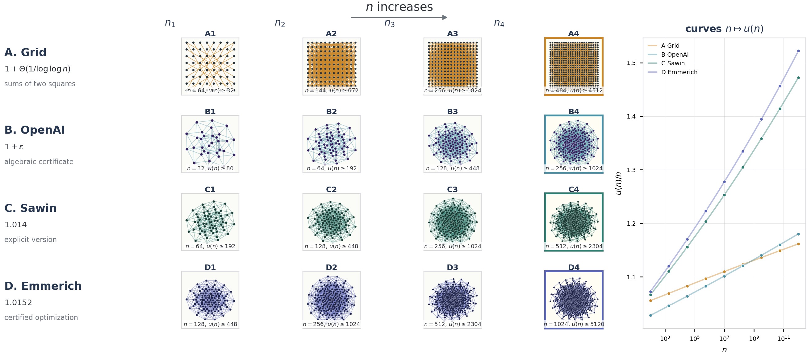
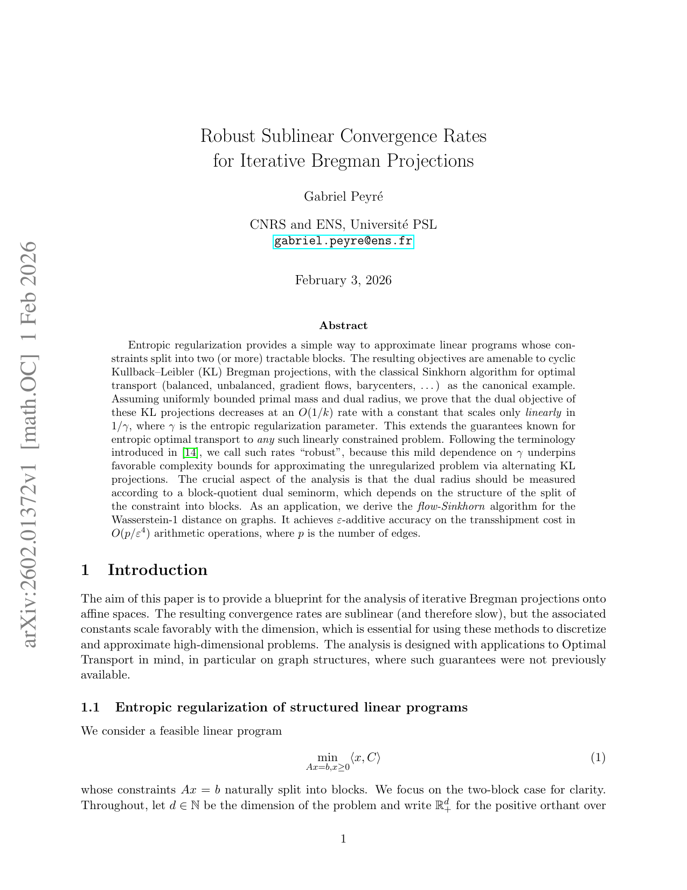
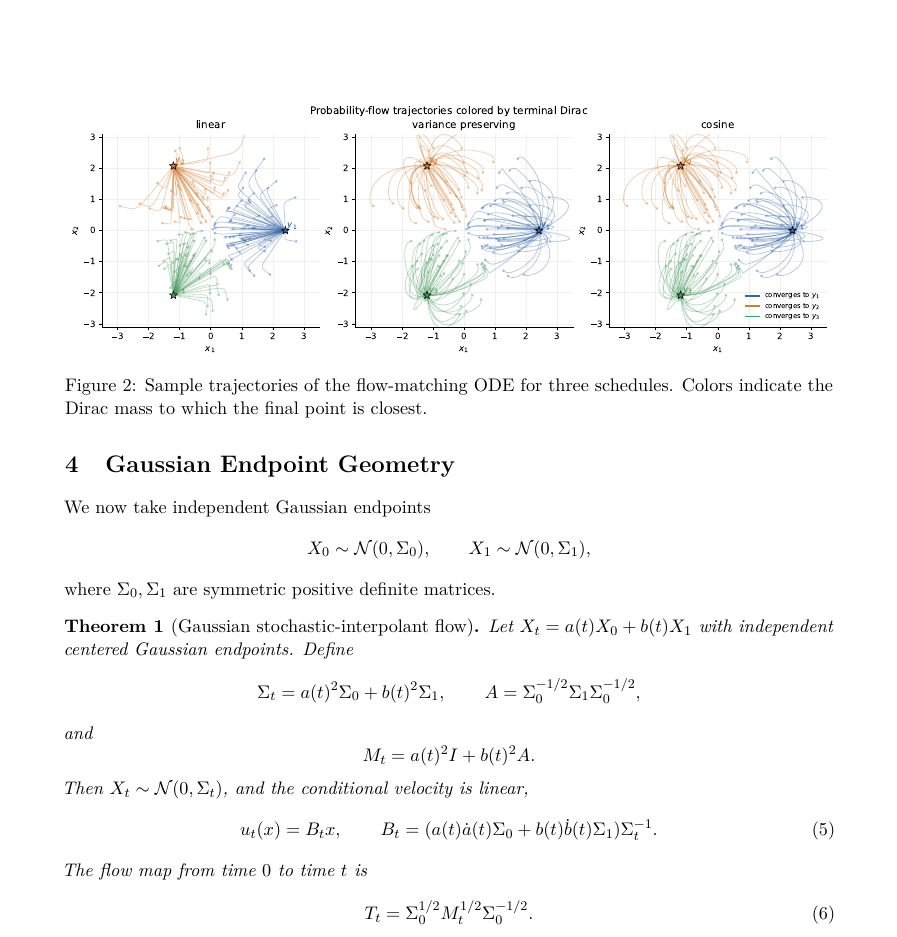
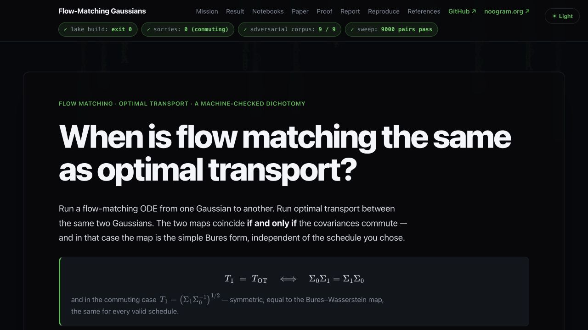
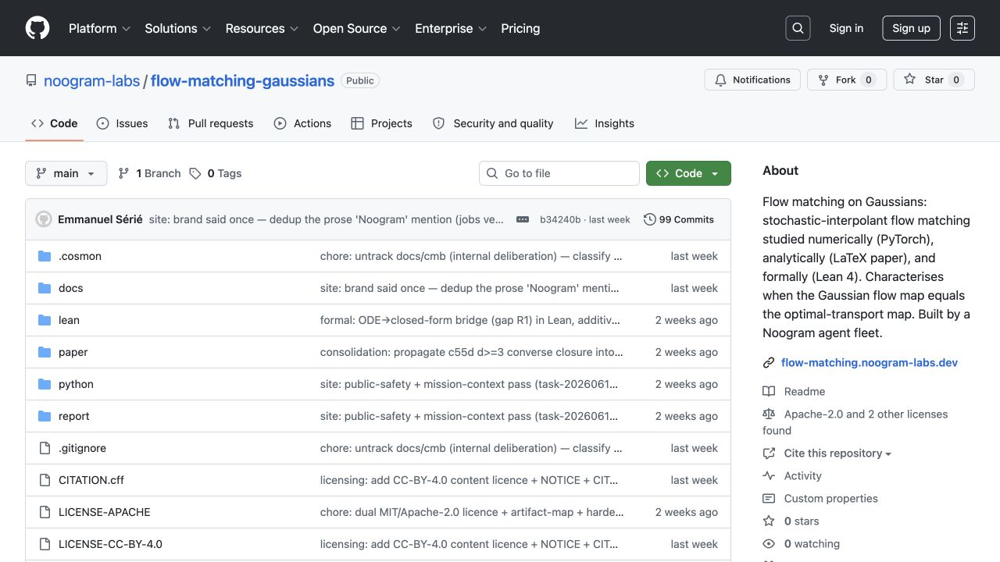

  

    
IA4Maths · 2026

    
AI for Theory

    
State of the art, uses and actions for the mathematical community

    

      <strong>Gabriel Peyré</strong> 
      CNRS and ENS, Université PSL  
      July 2, 2026 · <a href="https://github.com/gpeyre/ia4maths">github.com/gpeyre/ia4maths</a>
    

  

  

    
  

---

# Talk Roadmap

<Roadmap :active="1" lang="en" />

---

# AI for Mathematics

  

    <h3>AI for scientific discovery</h3>
    

      
    

    
PINNs to explore PDEs: Navier-Stokes / Euler, instabilities, counterexamples.

  

  

    <h3>AI for theorem proving</h3>
    

      
    

    
Lean: verified proof; Viazovska's optimal E8 packing.

  

  <strong>Focus:</strong> mathematical reasoning, from informal search to formal certification.

Wang--Lai--Gomez-Serrano--Buckmaster, arXiv:2201.06780; Hariharan et al., arXiv:2604.23468.

---

# LLMs for Reasoning and Mathematics

  

2017

Transformer

architecture

  

2020

GPT-3

scale

  

2022

ChatGPT

mass adoption

  

2024

o1

reasoning

  

2025

o3 / DeepSeek-R1

RL reasoning

  

2025

Gemini Deep Think

IMO-level

  

2026

Agentic code

Codex, Claude Code, OpenClaws

  

    <h3>Reasoning models</h3>
    

      o1 / o3DeepSeek-R1Gemini Deep ThinkClaude reasoning
    

  

  

    <h3>Agentic systems</h3>
    

      CodexClaude CodeMistral toolsOpenClaws
    

  

---

# Why Mathematics Became Central for LLMs

  <h3>Mathematics is a testbed for reasoning</h3>
  <ul class="key-list">
    <li><strong>Training</strong>Next-token prediction, then evaluation pressure toward reasoning.</li>
    <li><strong>Benchmarks</strong>GSM8K, MATH, AIME / IMO-style tasks as strategic signals.</li>
    <li><strong>Reasoning</strong>Reinforcement learning and rewards attached to mathematical correctness.</li>
  </ul>

  

    <h3>Benchmark snippets</h3>
    <ul class="key-list">
      <li><strong>GSM8K</strong>word arithmetic: "Alice buys 3 notebooks..."</li>
      <li><strong>MATH</strong>contest algebra, geometry, analysis, structured solutions.</li>
      <li><strong>AIME / IMO</strong>short statement, long search: determine, optimize, prove.</li>
    </ul>
  

  

    <h3>Takeaway</h3>
    
Agentic AI moves from local answers to a full pipeline: plan, code, verify, write.

  

Cobbe et al. 2021; Hendrycks et al. 2021; OpenAI Codex 2025/2026.

---

# Simple Problems: Mathematical Olympiads

  

28/42

2024 · AlphaProof + AlphaGeometry 2, formal pipeline

  

35/42

2025 · Gemini Deep Think, informal proofs

  

IMO

Small statements, long proof search, high signal

  

DeepMind 25/07/2024 and 21/07/2025; official IMO 2025 PDF.

---

# Talk Roadmap

<Roadmap :active="2" lang="en" />

---

# Research Level: First Proof

  <h3>Problem</h3>
  
Reproducible measurement of research-level proving: unseen problems, human solutions available, full write-up, anonymized acceptance.

  

    <h3>First Batch · 02/2026</h3>
    <ul class="key-list">
      <li><strong>Signal</strong>About <strong>2</strong> clear successes (Q9, Q10).</li>
      <li><strong>Gray zone</strong>Q5/Q8 close or repairable; no formal review.</li>
    </ul>
  

  

    <h3>Second Batch · 03-06/2026</h3>
    <ul class="key-list">
      <li><strong>OK</strong><strong>17/39</strong> submissions passed.</li>
      <li><strong>Coverage</strong><strong>7/10</strong> problems had at least one OK solution.</li>
      <li><strong>Criterion</strong>Flawless or minor revisions after anonymized expert review.</li>
    </ul>
  

  <strong>Takeaway:</strong> serious proofs are possible on nontrivial problems, but expert review remains the bottleneck.

ressources/first-proof-summary.md; 1stProof; arXiv:2602.05192; arXiv:2606.18119.

---

# Research Level: Unit Distance Conjecture

  

    

      <h3>Problem</h3>
      
<em>u(n)</em>: maximum number of unit-distance pairs among <em>n</em> planar points.

    

    

      <h3>OpenAI challenge</h3>
      
Resolve Erdos's planar unit-distance problem completely: prove the near-grid upper bound, or build counterexamples to it. <strong>No partial progress.</strong>

    

    <table class="unit-table">
      <thead><tr><th>Construction</th><th>Exponent</th></tr></thead>
      <tbody>
        <tr><td>Classical</td><td>1+o(1)</td></tr>
        <tr><td>OpenAI</td><td>&gt;1</td></tr>
        <tr><td>Sawin</td><td>1.014</td></tr>
        <tr><td>Emmerich</td><td><strong>1.0152</strong></td></tr>
      </tbody>
    </table>
  

  

    

      
    

    
OpenAI proof PDF p.3; Alon et al. 2605.20695; Sawin 2605.20579; Emmerich 2606.03419.

  

---

# Unit Distance: Four Constructions

  

    
  

  

    
A<strong>Grid</strong><em>1+o(1)</em>

    
B<strong>OpenAI</strong><em>&gt;1</em>

    
C<strong>Sawin</strong><em>1.014</em>

    
D<strong>Emmerich</strong><em>1.0152</em>

  

Erdos 1946; OpenAI proof PDF; Alon et al. 2605.20695; Sawin 2605.20579; Emmerich 2606.03419.

---

# Formal Mathematics: Viazovska Theorem in Lean

  

    <h3>Problem</h3>
    <ul class="key-list">
      <li><strong>Object</strong>Optimal packing in dimension 8, extension to dimension 24.</li>
      <li><strong>Stakes</strong>Transfer a very high-level proof into Lean.</li>
    </ul>
  

  

    <h3>Repository signal</h3>
    <ul class="key-list">
      <li><strong>Status</strong>Public, massive Lean project around E8 / Leech packing.</li>
      <li><strong>Size</strong><strong>830</strong> files, <strong>180,661</strong> Lean lines.</li>
      <li><strong>Reference</strong>FLT Lean: 117 files, 15,411 lines.</li>
    </ul>
  

  <strong>Governance point:</strong> academic to private transfer was controversial; formal mathematics raises questions of credit, maintenance and infrastructure.

GitHub repositories; Hariharan et al., arXiv:2604.23468; local count 09/03/2026.

---

# Formal Mathematics: Analysis / PDEs in Lean

  

    

      <h3>Problem</h3>
      
Formalize modern analysis, still sparsely covered by <code>mathlib</code>.

      
Use case: math expert, not Lean specialist, guided by LLM + formal checking.

    

    

theorem harnack
  (A : NormalizedEllipticCoeff d (ball 0 1))
  (hsol : IsSolution A.1 u) :
  essSup u μ_1/2 ≤
    exp(C_harnack d * A.1.Λ^1/2) * essInf u μ_1/2 := by ...
    

  

  

    

      <h3>Scott Armstrong + Julia Kempe</h3>
      
Harnack, Holder and reusable analysis foundations in <code>scottnarmstrong/DeGiorgi</code>.

      

        SobolevWeak HarnackHarnackHolder
      

    

    

      <ul class="key-list">
        <li><strong>Feasible</strong>with Claude/Codex pro accounts.</li>
        <li><strong>Expertise</strong>math guidance essential.</li>
        <li><strong>Cost</strong>many tokens, manageable with a blueprint.</li>
      </ul>
    

  

Armstrong--Kempe, arXiv:2604.05984; scottnarmstrong/DeGiorgi; Armstrong blog post 07/04/2026.

---

# Talk Roadmap

<Roadmap :active="3" lang="en" />

---

# My Research Experience

  

    

      <h3>Problem</h3>
      
Make progress on a well-scoped problem where one is stuck; use Lean as a non-specialist.

    

    

      <h3>Personal report</h3>
      <ul class="key-list">
        <li><strong>Unlock</strong>open problem solved in <strong>2 weeks</strong> through intensive GPT-5 prompting.</li>
        <li><strong>Preprint</strong><a href="https://arxiv.org/abs/2602.01372">arXiv:2602.01372</a></li>
        <li><strong>Agents</strong>Codex / Claude Code in daily use.</li>
        <li><strong>Library</strong><a href="https://github.com/gpeyre/flow-sinkhorn">github.com/gpeyre/flow-sinkhorn</a></li>
      </ul>
    

    

      <strong>Takeaway:</strong> informal reasoning can unlock ideas; Lean certification works but costs roughly 10x more tokens.
    

  

  

    
  

Personal experience + arXiv/GitHub, accessed 09/03/2026.

---

# Group Experience Report

  

    

      <h3>Collective evaluation at CSD, ENS</h3>
      <ul class="key-list">
        <li><strong>Protocol</strong>same prompt, multiple answers.</li>
        <li><strong>Task</strong>semi-open question, notebook, code, paper, formalization.</li>
        <li><strong>Audit</strong>submissions evaluated across several criteria.</li>
      </ul>
    

    

Consider flow matching with a stochastic interpolant a(t)*X0+b(t)*X1.
In python/ do an indepth numerical simulation ... X0 sim N(0,Id),
X1 is a mixture of three Dirac. In paper/ write a detailed LaTeX article ...
compute in closed form Sigma_t and the flow map T_t.
    

  

  

    

      
    

    
Snapshot: paper page from the codex-gabriel submission.

  

ressources/agentic-benchs/todo.md; comparative report 18/06/2026.

---

# Group Experience Report: Results

  

    <h3>LLM-as-judge aggregation</h3>
    <table class="score-table">
      <thead><tr><th>Submission</th><th>Math</th><th>Code</th><th>Overall</th></tr></thead>
      <tbody>
        <tr class="good"><td>emmanuel</td><td>9.3</td><td>8.8</td><td>9.1</td></tr>
        <tr class="good"><td>codex-gabriel</td><td>9.0</td><td>9.0</td><td>8.8</td></tr>
        <tr><td>openclaw</td><td>8.2</td><td>8.6</td><td>8.2</td></tr>
        <tr><td>hermes</td><td>7.8</td><td>8.0</td><td>7.7</td></tr>
        <tr><td>claude-gabriel</td><td>6.5</td><td>7.5</td><td>7.1</td></tr>
        <tr><td>codex-kimia</td><td>7.0</td><td>7.0</td><td>7.0</td></tr>
        <tr><td>codex-clement</td><td>7.0</td><td>5.5</td><td>6.2</td></tr>
        <tr><td>antigravity-a.</td><td>5.8</td><td>6.0</td><td>5.8</td></tr>
        <tr><td>antigravity-o.</td><td>5.5</td><td>5.0</td><td>5.4</td></tr>
      </tbody>
    </table>
  

  

    

      <h3>Robust signals</h3>
      <ul class="key-list">
        <li><strong>Math</strong>Codex &gt;&gt; Claude &gt;&gt; rest.</li>
        <li><strong>Code</strong>Claude &gt;&gt; Codex &gt;&gt; rest.</li>
        <li><strong>Budget</strong>performance approximately tracks tokens.</li>
      </ul>
    

    

      <h3>Token budget effect</h3>
      <ul class="key-list">
        <li><strong>Small</strong>incorrect proof.</li>
        <li><strong>Medium</strong>proof OK, statement imperfect.</li>
        <li><strong>Large</strong>complete solution.</li>
        <li><strong>Huge</strong>Lean viable.</li>
      </ul>
    

  

CSD experiment; audit ressources/agentic-benchs/report.

---

# Zoom: Emmanuel Sérié / Noogram

  

    

      <h3>CSD prompt to full scientific artifact</h3>
      
A complete chain: generate, test, refute, publish.

    

    

      <h3>Noogram contribution</h3>
      <ul class="key-list">
        <li><strong>Theorem</strong>Gaussian FM = OT iff covariances commute.</li>
        <li><strong>Artifacts</strong>site, code, paper, figures, Lean, report.</li>
        <li><strong>Audit</strong>false proof found and fixed; score <strong>9.1</strong>.</li>
      </ul>
    

    

      <strong>Takeaway:</strong> agent harnessing for science needs rigor, expert review and auditable cost.
    

  

  

    

    

  

Noogram site; GitHub noogram-labs/flow-matching-gaussians; CSD audit.

---

# Talk Roadmap

<Roadmap :active="4" lang="en" />

---

# Impact on Evaluation and Teaching

  

    <h3>Reviewing: AI as first reader</h3>
    

      
    

    

      first report
      local flaws
      suggestions
      weak signal
    

  

  

    <h3>Teaching: preserve human training</h3>
    
01<strong>Train before delegating</strong><em>PhD-level writing, code, local critique.</em>

    
02<strong>Evaluate understanding</strong><em>oral exams and proof critique.</em>

    
03<strong>Keep humans in the loop</strong><em>validity, novelty and taste remain human responsibilities.</em>

    
04<strong>Audit the tools</strong><em>AI reports are triage, not scientific validation.</em>

  

PaperReview.ai, Stanford ML Group, screenshot 02/07/2026; qualitative synthesis.

---

# Actions for the Community

  

    
Institutional layer

    <h3>Structure the community</h3>
    
Build a shared space between AI, mathematics, formalization and computer science.

    

      
<strong>CNRS RT</strong>national coordination

      
<strong>AISSAI</strong>"AI for mathematics" quarter

      
    

    

      Target
      <strong>shared benchmarks, reproducible audits, model access</strong>
    

  

  

    01
    <h3>Open access to models</h3>
    
Academic repositories connected to controllable, auditable models.

  

  

    02
    <h3>Dialogue with industry</h3>
    
Postdoc programs, shared tools, and channels for scientific feedback.

  

  

    03
    <h3>Do not forget training</h3>
    
Faculty design the tasks; evaluators preserve the human path to expertise.

  

---

# Conclusion

  

    <h3>1. Acceleration already visible</h3>
    <ul class="key-list">
      <li><strong>Performance</strong>very fast progress.</li>
      <li><strong>Workflows</strong>code, verify, write.</li>
    </ul>
  

  

    <h3>2. Concrete scientific impact</h3>
    <ul class="key-list">
      <li><strong>Informal</strong>open problems unlocked.</li>
      <li><strong>Formal</strong>Lean progressing, high token cost.</li>
    </ul>
  

  

    <h3>3. Human role displaced</h3>
    <ul class="key-list">
      <li><strong>Positioning</strong>augment, not replace.</li>
      <li><strong>Role</strong>researcher to judge of proof quality.</li>
    </ul>
  

  

    <h3>4. Collective stakes</h3>
    <ul class="key-list">
      <li><strong>Access</strong>controllable and auditable models.</li>
      <li><strong>Tension</strong>academic-industry exchanges.</li>
      <li><strong>Sovereignty</strong>scientific and institutional framing.</li>
    </ul>
  

